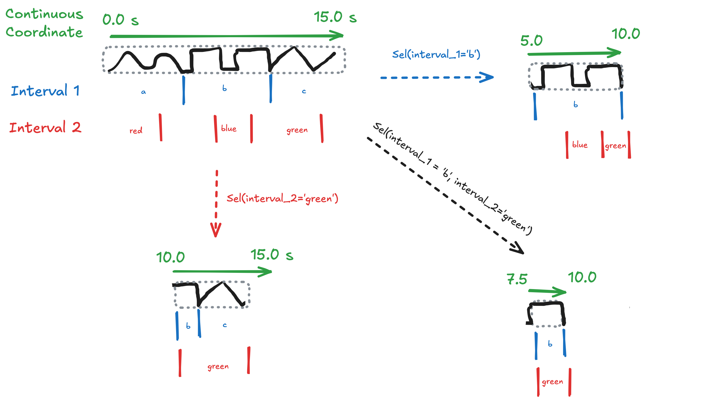
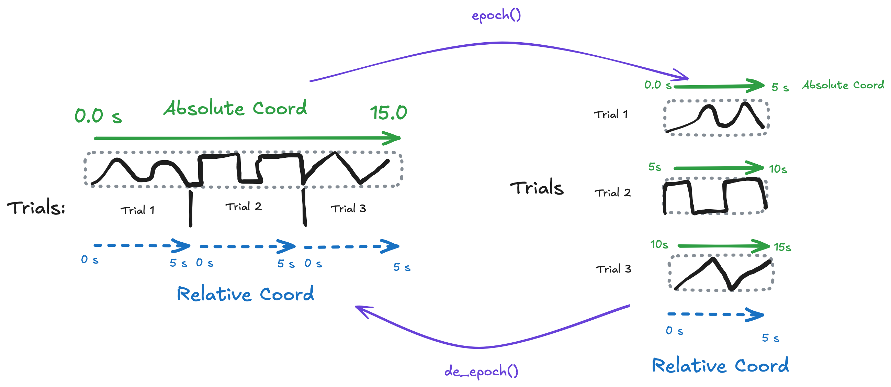

---
kernelspec:
  name: python3
  display_name: Python 3
---

# Linked Indices

Custom xarray indexes for keeping multiple coordinates in sync across shared dimensions.

## Overview

This library provides custom [xarray Index](https://docs.xarray.dev/en/stable/internals/how-to-create-custom-index.html) implementations that automatically constrain related dimensions when you select on any one of them.


### DimensionInterval

The DimensionInterval provides the ability to performantly store arbitrary intervals over a continuous coordinate. Like a multiindex but more generalized. See the [comparison with MultiIndex](alt-multiindex.ipynb) for an understanding of the comparison.



See the [Multi-Interval Example](multi_interval_example.ipynb) for a detailed walkthrough.

### NDIndex

Provides the ability to select on N-dimensional derived coordinates (like absolute time computed from trial offsets + relative time).



See the [ND Coordinates Example](nd_index_demo.ipynb) for a detailed walkthrough covering trial-based data with both absolute and relative time coordinates.

```{note}
The time-locking/epoching workflow shown in the diagram is not yet implemented. NDIndex currently supports selection on N-D coordinates but does not yet provide utilities for building multiple time reference frames.
```

### Use Cases

- **Speech/audio data** with hierarchical annotations (words, phonemes, time)
- **Time series** with multiple granularities of events
- **Any data** where intervals at different scales need to stay synchronized

## Installation

<!-- ```bash
pip install linked-indices
``` -->

```bash
pip install git+https://github.com/ianhi/xarray-linked-indexes
```

## Quick Start

```{code-cell} python
from linked_indices.example_data import multi_interval_dataset
from linked_indices import DimensionInterval

# Load example dataset with time, words, and phonemes
ds = multi_interval_dataset()

# Apply the linked index
ds = ds.drop_indexes(["time", "word", "phoneme"]).set_xindex(
    ["time", "word_intervals", "phoneme_intervals", "word", "part_of_speech", "phoneme"],
    DimensionInterval,
)
ds
```

Now selecting on any dimension automatically constrains all other dimensions to overlapping values:

```{code-cell} python
# Select word "red" - time and phonemes are auto-constrained to [0, 40)
ds.sel(word="red")
```

## Using onset/duration format

As an alternative to creating `pd.IntervalIndex` objects, you can use onset/duration coordinates directly. This is useful when your data comes from annotation tools that export onset + duration format.

```python
ds = ds.drop_indexes(["time", "word"]).set_xindex(
    ["time", "word_onset", "word_duration", "word"],
    DimensionInterval,
    onset_duration_coords={"word": ("word_onset", "word_duration")},
)
```

**Options:**
- `onset_duration_coords`: Dict mapping dimension names to `(onset_coord, duration_coord)` tuples
- `interval_closed`: How intervals are closed (`"left"`, `"right"`, `"both"`, `"neither"`). Default: `"left"`

See the [Onset/Duration Example](onset_duration_example.ipynb) notebook for a detailed walkthrough.

## Examples

See the [example notebook](multi_interval_example.ipynb) for a detailed walkthrough of multiple interval types (words, phonemes) over a shared continuous time dimension.

## API Reference

### DimensionInterval

The main index class for linking multiple interval dimensions over a single continuous dimension.

**Features:**
- Automatic cross-slicing between all linked dimensions
- Support for multiple label coordinates per interval dimension
- Works with both `sel()` and `isel()` operations

**Known Limitations:**
- Array indexers (fancy indexing) not fully supported for interval dimensions
- Non-contiguous intervals (gaps) are supported but may produce unexpected results when computing time ranges that span multiple intervals
